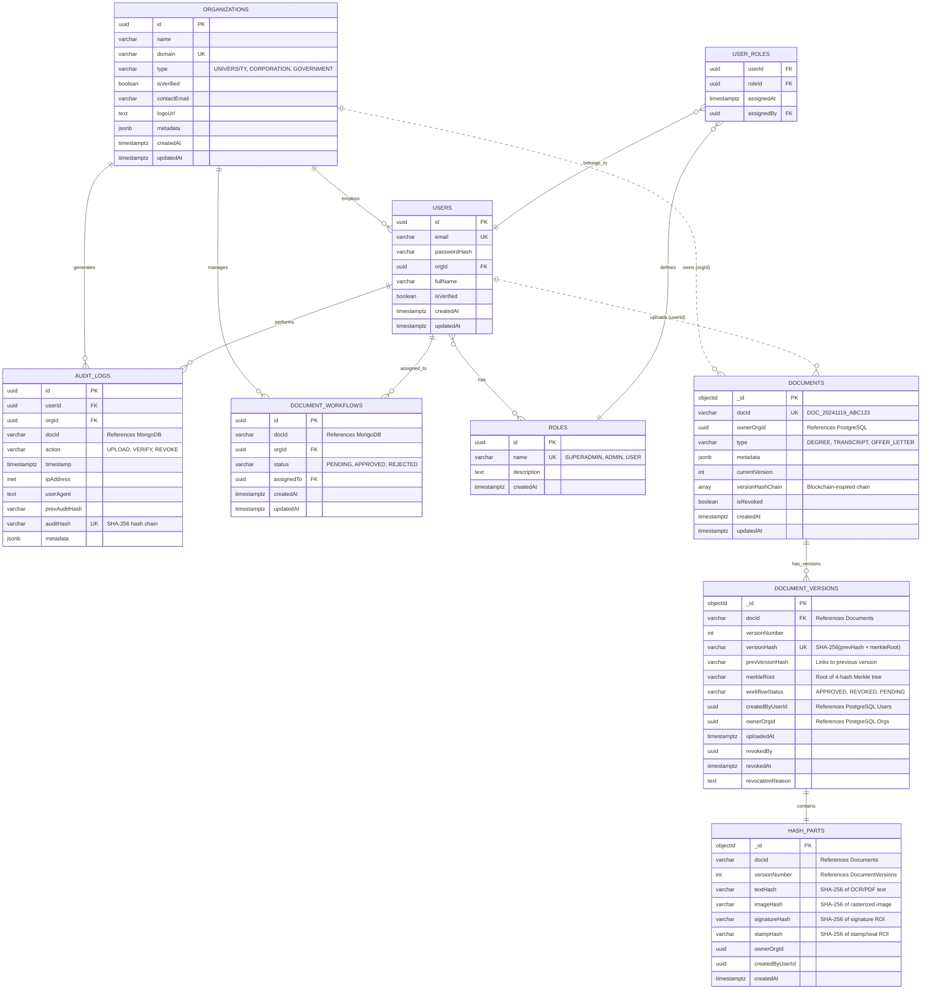

# PapDocAuthX - Database Schema ER Diagram

## Entity-Relationship Diagram

## Database Architecture Overview

### **Polyglot Persistence Strategy**

PapDocAuthX uses a **hybrid PostgreSQL + MongoDB architecture** to optimize for different data access patterns:

#### **PostgreSQL (Relational - ACID Critical)**

- **Users & Authentication** - Strong consistency, ACID transactions
- **Organizations** - Referential integrity, structured queries
- **Audit Logs** - Tamper-proof hash chains, immutability via triggers
- **Roles & Permissions** - RBAC with many-to-many relationships
- **Document Workflows** - State transitions, complex joins

#### **MongoDB (Document Store - Scalability)**
- **Documents** - Flexible metadata schema, rapid iteration
- **Document Versions** - Rapidly growing version history, horizontal scaling
- **Hash Parts** - Multimodal cryptographic hashes (4 types per version)

### **Cross-Database References**

References between PostgreSQL and MongoDB are maintained via **UUID/String identifiers**:

- `Documents.ownerOrgId` → `Organizations.id` (PostgreSQL)
- `DocumentVersions.createdByUserId` → `Users.id` (PostgreSQL)
- `AuditLogs.docId` → `Documents.docId` (MongoDB)

**Note:** No foreign key constraints across databases - maintained via application logic

---

## Key Relationships

(See full diagram in repository)

**Last Updated:** 2025-11-19  
**Author:** Lovepreet Singh  
**Database Versions:** PostgreSQL 18.1, MongoDB 6.x
