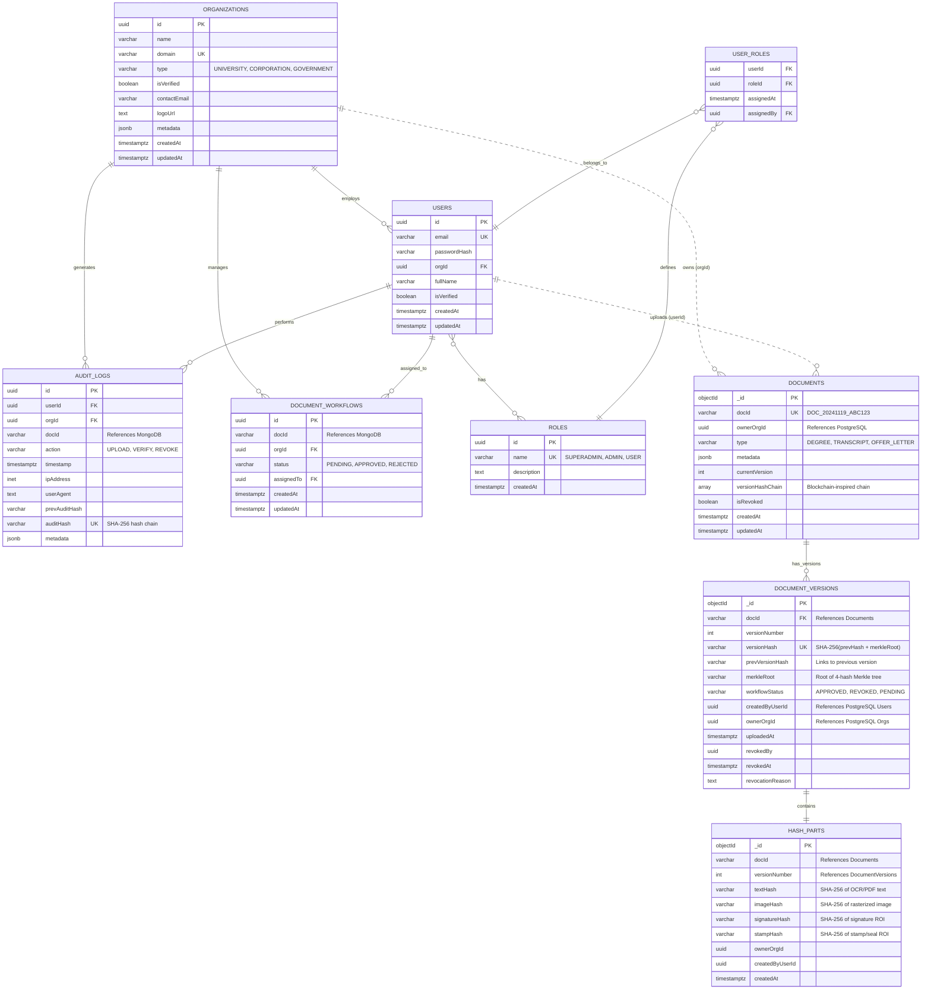

# PapDocAuthX v2 - Database Schema ER Diagram

## Entity-Relationship Diagram



## Database Architecture Overview

### **Polyglot Persistence Strategy**

PapDocAuthX v2 uses a **hybrid PostgreSQL + MongoDB architecture** to optimize for different data access patterns:

#### **PostgreSQL (Relational - ACID Critical)**
- **Users & Authentication** - Strong consistency, ACID transactions
- **Organizations** - Referential integrity, structured queries
- **Audit Logs** - Tamper-proof hash chains, immutability via triggers
- **Roles & Permissions** - RBAC with many-to-many relationships
- **Document Workflows** - State transitions, complex joins

#### **MongoDB (Document Store - Scalability)**
- **Documents** - Flexible metadata schema, rapid iteration
- **Document Versions** - Rapidly growing version history, horizontal scaling
- **Hash Parts** - Multimodal cryptographic hashes (4 types per version)

### **Cross-Database References**

References between PostgreSQL and MongoDB are maintained via **UUID/String identifiers**:

- `Documents.ownerOrgId` → `Organizations.id` (PostgreSQL)
- `DocumentVersions.createdByUserId` → `Users.id` (PostgreSQL)
- `AuditLogs.docId` → `Documents.docId` (MongoDB)

**Note:** No foreign key constraints across databases - maintained via application logic

---

## Key Relationships

### **1. Organization → Users (One-to-Many)**
```sql
SELECT u.* FROM users u
INNER JOIN organizations o ON u."orgId" = o.id
WHERE o.name = 'Stanford University';
```

### **2. User → Roles (Many-to-Many)**
```sql
SELECT u.email, r.name as role
FROM users u
INNER JOIN user_roles ur ON u.id = ur."userId"
INNER JOIN roles r ON ur."roleId" = r.id
WHERE u.email = 'admin@stanford.edu';
```

### **3. Document → Versions (One-to-Many, MongoDB)**
```javascript
// Find all versions of a document
db.documentVersions.find({ docId: "DOC_20241119_ABC123" })
    .sort({ versionNumber: -1 });
```

### **4. Document Version → Hash Parts (One-to-One, MongoDB)**
```javascript
// Get hash parts for specific version
db.hashParts.findOne({ 
    docId: "DOC_20241119_ABC123", 
    versionNumber: 2 
});
```

### **5. Audit Chain Linkage (Self-Referential)**
```sql
-- Verify audit chain integrity
SELECT 
    a1.id,
    a1."auditHash",
    a1."prevAuditHash",
    a2."auditHash" as expected_prev_hash,
    (a1."prevAuditHash" = a2."auditHash") as chain_valid
FROM audit_logs a1
LEFT JOIN audit_logs a2 ON a1."prevAuditHash" = a2."auditHash"
WHERE a1."orgId" = 1 AND a1."docId" = 'DOC-001'
ORDER BY a1.timestamp;
```

---

## Cryptographic Hash Chains

### **Version Hash Chain (MongoDB)**

Each document version computes:
```
versionHash = SHA256(prevVersionHash + merkleRoot + timestamp + userId + orgId)
```

**Chain Structure:**
```
Version 1: prevHash = null,     versionHash = "abc123..."
           ↓
Version 2: prevHash = "abc123", versionHash = "def456..."
           ↓
Version 3: prevHash = "def456", versionHash = "ghi789..."
```

### **Audit Hash Chain (PostgreSQL)**

Each audit log entry computes:
```
auditHash = SHA256(userId + orgId + docId + action + timestamp + prevAuditHash + SECRET)
```

**Chain Structure:**
```
Log 1: prevAuditHash = null,     auditHash = "aaa111..."
       ↓
Log 2: prevAuditHash = "aaa111", auditHash = "bbb222..."
       ↓
Log 3: prevAuditHash = "bbb222", auditHash = "ccc333..."
```

### **Merkle Root (Hash Parts)**

Combines 4 multimodal hashes:
```
        merkleRoot
       /          \
   H(t+i)        H(s+st)
   /    \        /     \
  text image  sig   stamp
```

```
leaf1 = SHA256(textHash + imageHash)
leaf2 = SHA256(signatureHash + stampHash)
merkleRoot = SHA256(leaf1 + leaf2)
```

---

## Indexes & Partitioning

### **PostgreSQL Indexes (Migration 001)**

| Table | Index | Type | Purpose |
|-------|-------|------|---------|
| users | idx_users_email | BTREE | Login queries |
| users | idx_users_org_id | BTREE | Org user listings |
| users | idx_users_org_role | BTREE (composite) | RBAC queries |
| organizations | idx_organizations_name | GIN (trigram) | Full-text search |
| organizations | idx_organizations_domain | HASH | Exact domain match |
| audit_logs | idx_audit_logs_org_timestamp | BTREE (composite) | Org audit trails |
| audit_logs | idx_audit_logs_doc_id | BTREE | Document history |
| audit_logs | idx_audit_logs_prev_hash | BTREE | Chain verification |
| document_workflow | idx_document_workflows_org_status | BTREE (composite) | Dashboard queries |

### **Partitioning (Migration 002)**

**Audit Logs** - Range partitioned by month:
```
audit_logs (parent table)
├── audit_logs_2024_06 (Jun 2024)
├── audit_logs_2024_07 (Jul 2024)
├── audit_logs_2024_08 (Aug 2024)
├── ... (13 monthly partitions)
└── audit_logs_default (overflow)
```

**Benefits:**
- Partition pruning reduces query scope
- Faster archival (drop old partitions vs DELETE)
- Parallel VACUUM/ANALYZE

### **MongoDB Indexes**

```javascript
// Documents
db.documents.createIndex({ docId: 1 }, { unique: true });
db.documents.createIndex({ ownerOrgId: 1 });
db.documents.createIndex({ type: 1 });
db.documents.createIndex({ isRevoked: 1 });

// Document Versions
db.documentVersions.createIndex({ docId: 1, versionNumber: 1 }, { unique: true });
db.documentVersions.createIndex({ versionHash: 1 }, { unique: true });
db.documentVersions.createIndex({ docId: 1, workflowStatus: 1 });

// Hash Parts
db.hashParts.createIndex({ docId: 1, versionNumber: 1 }, { unique: true });
db.hashParts.createIndex({ textHash: 1 });
db.hashParts.createIndex({ imageHash: 1 });
```

---

## Triggers & Stored Procedures

### **Triggers (Migration 004)**

1. **Auto-Update Timestamps**
   - `trigger_users_updated_at` → Updates `updatedAt` on Users
   - `trigger_organizations_updated_at` → Updates `updatedAt` on Organizations

2. **Audit Log Immutability**
   - `trigger_prevent_audit_modification` → Blocks UPDATE on audit_logs
   - `trigger_prevent_audit_deletion` → Blocks DELETE on audit_logs

3. **Chain Validation**
   - `trigger_validate_chain` → Validates hash chain on INSERT

### **Stored Procedures (Migration 003)**

1. **verify_audit_chain(orgId, docId)**
   - Validates hash chain integrity
   - Returns broken links and hash mismatches

2. **get_org_stats(orgId)**
   - Aggregates organization statistics
   - Used by dashboard analytics

3. **get_document_history(docId)**
   - Returns complete version timeline
   - Includes hash chain verification

4. **refresh_analytics_views()**
   - Refreshes all materialized views
   - Scheduled maintenance function

---

## Materialized Views (Migration 005)

### **mv_org_stats**
Pre-computed organization dashboard metrics:
```sql
SELECT * FROM mv_org_stats WHERE org_id = 1;
-- Returns: user_count, document_count, recent_activity
```

### **mv_document_activity**
Document-level analytics:
```sql
SELECT * FROM mv_document_activity 
ORDER BY verification_count DESC LIMIT 10;
-- Returns: Most verified documents
```

### **mv_user_activity**
User engagement metrics:
```sql
SELECT * FROM mv_user_activity 
ORDER BY total_actions DESC LIMIT 10;
-- Returns: Most active users
```

---

## Transaction Boundaries

### **MongoDB Transactions (Document Operations)**
```javascript
// Upload document with ACID guarantees
const session = await mongoose.startSession();
await session.withTransaction(async () => {
    await Document.create([{...}], { session });
    await DocumentVersion.create([{...}], { session });
    await HashPart.create([{...}], { session });
});
```

### **PostgreSQL Transactions (Org/User Operations)**
```javascript
// Create organization + admin atomically
await sequelize.transaction(async (t) => {
    const org = await Organization.create({...}, { transaction: t });
    await User.create({...}, { transaction: t });
    await UserRole.create({...}, { transaction: t });
});
```

---

## Data Integrity Constraints

### **PostgreSQL Constraints**

```sql
-- Foreign keys with cascade behavior
ALTER TABLE users 
    ADD CONSTRAINT fk_users_org 
    FOREIGN KEY ("orgId") REFERENCES organizations(id) 
    ON DELETE SET NULL;

ALTER TABLE user_roles 
    ADD CONSTRAINT fk_user_roles_user 
    FOREIGN KEY ("userId") REFERENCES users(id) 
    ON DELETE CASCADE;

-- Unique constraints
ALTER TABLE users ADD CONSTRAINT uq_users_email UNIQUE (email);
ALTER TABLE audit_logs ADD CONSTRAINT uq_audit_hash UNIQUE ("auditHash");
```

### **MongoDB Schema Validation**

```javascript
// Document schema validation
db.createCollection("documents", {
    validator: {
        $jsonSchema: {
            required: ["docId", "ownerOrgId", "type", "currentVersion"],
            properties: {
                docId: { bsonType: "string", pattern: "^DOC_" },
                currentVersion: { bsonType: "int", minimum: 0 },
                versionHashChain: { bsonType: "array" }
            }
        }
    }
});
```

---

## Scalability Considerations

### **Horizontal Scaling (MongoDB)**
- Sharding strategy: Shard key = `docId` (hashed)
- Replica sets for high availability
- Read preference: secondaryPreferred for analytics

### **Vertical Scaling (PostgreSQL)**
- Connection pooling (PgBouncer)
- Read replicas for analytics queries
- Partition maintenance (monthly cleanup)

### **Caching Strategy**
- Redis for session management
- Materialized views for dashboard queries (99% faster)
- Application-level caching for organization metadata

---

## Diagram Generation Tool

This ER diagram was created using **Mermaid.js** - a text-based diagramming tool.

To view/edit:
1. Copy the mermaid code block
2. Visit https://mermaid.live
3. Paste and render

Alternative tools:
- **dbdiagram.io** - Database schema designer
- **draw.io** - Visual ER diagram tool
- **pgModeler** - PostgreSQL-specific modeling

---

**Last Updated:** 2025-11-19  
**Author:** Lovepreet Singh  
**Database Versions:** PostgreSQL 18.1, MongoDB 6.x
