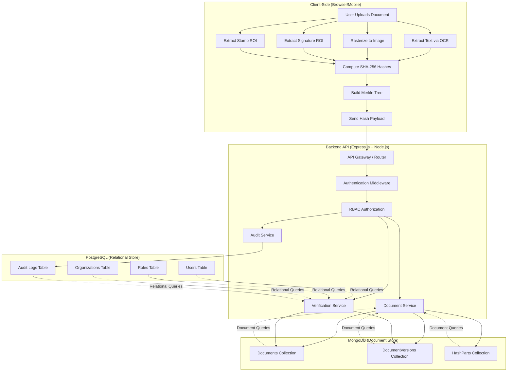

# PapDocAuthX+ v2

## Enterprise-Grade Polyglot Document Authentication Backend

[](LICENSE)
[](https://nodejs.org/)
[](https://www.postgresql.org/)
[](https://www.mongodb.com/)

> ⚠️ **Security Notice**: This is a reference implementation for educational purposes. Before deploying to production, conduct a thorough security audit and customize security configurations.

---

## 📋 Table of Contents

- [Project Overview](#project-overview)
- [Problem Statement](#problem-statement)
- [Core Features](#core-features)
- [Architecture](#architecture)
- [Database Design](#database-design)
- [API Reference](#api-reference)
- [Cryptographic Verification Logic](#cryptographic-verification-logic)
- [Client-Side Integration](#client-side-integration)
- [Installation & Setup](#installation--setup)
- [Environment Configuration](#environment-configuration)
- [Database Seeding](#database-seeding)
- [Deployment Guide](#deployment-guide)
- [Security Best Practices](#security-best-practices)
- [Contributing](#contributing)
- [License](#license)

---

## 🎯 Project Overview

**PapDocAuthX+ v2** is a next-generation, production-ready backend system engineered to address a critical challenge facing universities, corporations, government agencies, and HR departments worldwide:

> **How can institutions verify the authenticity of sensitive documents—degrees, transcripts, offer letters, certificates, and legal documents—without exposing the actual documents or relying on insecure file-sharing mechanisms?**

### The Zero-Document-Upload Paradigm

Unlike traditional document verification systems that require full file uploads to centralized servers, PapDocAuthX+ v2 implements a revolutionary **zero-document-upload verification model**. The server never stores PDFs, images, signatures, or raw text content. Instead, it stores only **multimodal cryptographic fingerprints** that are computed client-side before transmission.

### What Makes PapDocAuthX+ v2 Unique?

PapDocAuthX+ v2 combines cutting-edge cryptographic techniques with enterprise-grade architecture to deliver:

- **Multimodal Hashing**: Four independent cryptographic hashes (text, raster image, signature ROI, stamp ROI) provide defense-in-depth against sophisticated document forgery
- **Merkle Tree Integrity**: Binary Merkle tree roots ensure that even single-pixel modifications are cryptographically detectable
- **Tamper-Proof Version Chains**: Blockchain-inspired version linking in MongoDB creates an immutable document evolution history
- **ACID-Guaranteed Audit Logs**: PostgreSQL-backed audit chains prevent tampering even by database administrators
- **Role-Based Access Control (RBAC)**: Granular permission system ensures only authorized personnel can issue or revoke documents
- **QR-Based Public Verification**: Anyone can verify document authenticity via QR codes without system access
- **Polyglot Persistence**: Hybrid SQL + NoSQL architecture optimizes for both relational integrity and horizontal scalability

### Enterprise Security Guarantees

PapDocAuthX+ v2 provides four fundamental security guarantees:

1. **Strong Authenticity**: Every document version is cryptographically linked to previous versions using immutable version hashes, creating a verifiable chain of custody
2. **Strong Integrity**: Cryptographic audit chains prevent unauthorized modifications, even by privileged database administrators
3. **Strong Privacy**: Original documents never leave the user's device; only cryptographic fingerprints are transmitted
4. **Strong Authority Validation**: Only verified administrators within authenticated organizations can issue official documents

### Real-World Applications

This system architecture is inspired by production systems deployed in:

- **Government Digital Identity Systems** (e.g., DigiLocker)
- **University Transcript Verification** (e.g., National Student Clearinghouse)
- **Embassy Document Authentication**
- **HR Onboarding & Background Verification**
- **Legal Document Notarization**

---

## 🚨 Problem Statement

### The Crisis of Traditional Document Verification

Current document verification systems suffer from fundamental architectural and security limitations:

#### 1. **Privacy Violation Through Full-Document Uploads**
Traditional systems require users to upload complete PDFs or images to third-party servers, exposing sensitive information and creating data breach risks.

#### 2. **Email-Based Verification Bottlenecks**
Manual email chains between departments create processing delays (days to weeks), human errors, and phishing attack surfaces.

#### 3. **Vulnerability to Sophisticated Forgery**
Modern document editing tools enable layer-by-layer PDF manipulation, signature transplantation, and stamp/seal replication that defeat visual inspection.

#### 4. **Absence of Cryptographic Proof**
Most systems rely on visual inspection or basic OCR, which cannot detect pixel-perfect forgeries or provide mathematical proof of authenticity.

#### 5. **No Immutable Audit Trail**
Without cryptographic audit logs, database administrators can alter records, version history can be rewritten, and accountability cannot be proven.

### How PapDocAuthX+ v2 Solves These Problems

| Problem | PapDocAuthX+ v2 Solution |
|---------|-------------------------|
| Full-document uploads | **Client-side hashing**: Only cryptographic fingerprints transmitted |
| Email verification delays | **Real-time cryptographic verification**: Instant validation via API |
| Sophisticated forgery | **Multimodal hashing**: Text + image + signature + stamp verification |
| Visual inspection limitations | **Merkle root validation**: Cryptographic proof of integrity |
| Database tampering | **Chained audit logs**: Tamper-evident cryptographic chains |
| Manual verification overhead | **QR-based public verification**: Automated validation workflow |

---

## ✨ Core Features

### Feature 1: Multimodal Document Fingerprinting

Instead of a single hash, PapDocAuthX+ v2 uses **four independent cryptographic hashes**:

```
1. TEXT HASH (textHash)
   ├─ Extracted via OCR or native PDF text streams
   ├─ Normalized (whitespace, case handling)
   └─ SHA-256 hash of canonical text representation

2. IMAGE HASH (imageHash)
   ├─ Full-page rasterization at standardized DPI
   ├─ Converted to grayscale/normalized
   └─ SHA-256 hash of pixel matrix

3. SIGNATURE HASH (signatureHash)
   ├─ Region of Interest (ROI) extraction
   ├─ Signature bounding box isolation
   └─ SHA-256 hash of signature pixel region

4. STAMP/SEAL HASH (stampHash)
   ├─ ROI extraction for official stamps/seals
   ├─ Circular/rectangular seal detection
   └─ SHA-256 hash of stamp pixel region
```

**Defense-in-Depth Principle**: An attacker must now replicate exact text, pixel-level appearance, authentic signatures, and institutional stamps simultaneously—exponentially increasing forgery complexity.

---

### Feature 2: Merkle Root for Integrity

The four multimodal hashes are combined into a **binary Merkle tree**:

```
                    MERKLE_ROOT
                   /            \
            HASH(H1+H2)      HASH(H3+H4)
             /      \          /      \
        textHash imageHash sigHash stampHash
```

**Merkle Root Computation**:
```javascript
const leaf1 = sha256(textHash + imageHash)
const leaf2 = sha256(signatureHash + stampHash)
const merkleRoot = sha256(leaf1 + leaf2)
```

**Mathematical Properties**:
- **Avalanche Effect**: Single bit change → completely different Merkle root
- **Collision Resistance**: Computationally infeasible to find duplicate roots
- **Tamper Evidence**: Any modification breaks cryptographic chain

---

### Feature 3: Tamper-Proof Version Chain (MongoDB)

Each document version computes a hash that includes:

**Version Hash Formula**:
```javascript
versionHash = sha256(
    prevVersionHash + 
    merkleRoot + 
    timestamp + 
    adminId + 
    orgId
)
```

**Blockchain-Inspired Chain Structure**:
```
VERSION 1 (Initial Upload)
├─ prevVersionHash: null
├─ versionHash: abc123...
├─ merkleRoot: def456...
└─ status: APPROVED

VERSION 2 (Correction)
├─ prevVersionHash: abc123... (links to V1)
├─ versionHash: ghi789...
├─ merkleRoot: jkl012... (new content)
└─ status: APPROVED

VERSION 3 (Revoked)
├─ prevVersionHash: ghi789... (links to V2)
├─ status: REVOKED
```

**Immutability**: Tampering with any version requires recalculating all subsequent version hashes—computationally infeasible.

---

### Feature 4: Enterprise Audit Chain (PostgreSQL)

Every system action generates an audit record with a chained hash:

**Audit Hash Formula**:
```javascript
auditHash = sha256(
    userId + 
    orgId + 
    docId + 
    action + 
    timestamp + 
    prevAuditHash + 
    HASH_SECRET  // Server-side secret salt
)
```

**Tamper-Evident Properties**:
- Database administrators cannot modify past records without breaking the hash chain
- Secret salt prevents offline hash recalculation attacks
- PostgreSQL ACID guarantees ensure atomicity
- Indexed hash chain enables fast integrity verification

---

### Feature 5: Role-Based Access Control (RBAC)

**Three-Tier Permission Model**:

**1. SUPERADMIN (Platform Owner)**
- Create organizations
- Assign admin roles
- View global analytics
- System configuration

**2. ADMIN (Organization Document Issuer)**
- Upload document versions (org-scoped)
- Revoke documents
- View organization analytics
- Generate QR codes

**3. USER (Verifier)**
- Verify documents (public API)
- View verification history
- Generate verification reports

---

### Feature 6: QR-Based Public Verification

Each approved document version generates a QR code encoding:

```json
{
    "docId": "DOC_20240115_ABC123",
    "versionHash": "9f8e7d6c5b4a3...",
    "merkleRoot": "1a2b3c4d5e6f7...",
    "verifyUrl": "https://verify.papdocauth.com/v/{docId}/{versionHash}"
}
```

**Public Verification Flow**:
1. User scans QR code
2. Frontend extracts verification URL
3. Public API endpoint validates document
4. Returns verification result (no authentication required)

---

### Feature 7: Polyglot Architecture

**PostgreSQL (ACID Relational Store)**
- User authentication & authorization
- Organization management
- Audit logs (immutable, chained)
- Role relationships
- Analytics queries

**MongoDB (Flexible Document Store)**
- Document metadata
- Version history (rapidly growing)
- Multimodal hash parts
- Horizontal scaling

---

## 🏗️ Architecture

### System Architecture Diagram



### Request Flow: Document Upload

```
┌────────────┐
│  Client    │
│  (Hash)    │
└─────┬──────┘
      │ POST /api/documents/upload
      │ Headers: Authorization: Bearer <JWT>
      │ Body: { textHash, imageHash, sigHash, stampHash, metadata }
      │
      ▼
┌─────────────────────────────────────────────┐
│  Express.js Middleware Chain                │
│  1. CORS Handler                            │
│  2. Body Parser                             │
│  3. JWT Authentication                      │
│  4. RBAC Check (ADMIN role required)        │
│  5. Rate Limiter                            │
└─────────────┬───────────────────────────────┘
              │
              ▼
┌─────────────────────────────────────────────┐
│  Document Service                           │
│  1. Validate hash format                    │
│  2. Compute Merkle root                     │
│  3. Check for existing doc                  │
│  4. Generate docId                          │
└─────────────┬───────────────────────────────┘
              │
              ▼
┌─────────────────────────────────────────────┐
│  MongoDB Transaction                        │
│  1. Insert Document record                  │
│  2. Insert DocumentVersion                  │
│  3. Insert HashParts (4 records)            │
│  4. Commit transaction                      │
└─────────────┬───────────────────────────────┘
              │
              ▼
┌─────────────────────────────────────────────┐
│  Audit Service                              │
│  1. Fetch previous audit hash               │
│  2. Compute new audit hash                  │
│  3. Insert audit_logs record (PostgreSQL)   │
└─────────────┬───────────────────────────────┘
              │
              ▼
┌─────────────────────────────────────────────┐
│  Response                                   │
│  {                                          │
│    success: true,                           │
│    docId: "DOC_20240115_ABC",               │
│    versionHash: "9f8e7d...",                │
│    merkleRoot: "1a2b3c...",                 │
│    qrCode: "data:image/png;base64,..."      │
│  }                                          │
└─────────────────────────────────────────────┘
```

---

## 🗄️ Database Design

### PostgreSQL Schema (Relational)

#### 1. Users Table
```sql
CREATE TABLE users (
    id UUID PRIMARY KEY DEFAULT gen_random_uuid(),
    email VARCHAR(255) UNIQUE NOT NULL,
    password_hash VARCHAR(255) NOT NULL,
    org_id UUID REFERENCES organizations(id) ON DELETE SET NULL,
    full_name VARCHAR(255),
    is_verified BOOLEAN DEFAULT false,
    created_at TIMESTAMPTZ DEFAULT NOW(),
    updated_at TIMESTAMPTZ DEFAULT NOW()
);

CREATE INDEX idx_users_email ON users(email);
CREATE INDEX idx_users_org ON users(org_id);
```

#### 2. Roles Table
```sql
CREATE TABLE roles (
    id UUID PRIMARY KEY DEFAULT gen_random_uuid(),
    name VARCHAR(50) UNIQUE NOT NULL,
    description TEXT,
    created_at TIMESTAMPTZ DEFAULT NOW()
);

-- Seed roles
INSERT INTO roles (name, description) VALUES
    ('SUPERADMIN', 'Platform administrator with full system access'),
    ('ADMIN', 'Organization administrator who can issue documents'),
    ('USER', 'Standard user with verification permissions');
```

#### 3. User-Roles Junction Table
```sql
CREATE TABLE user_roles (
    user_id UUID REFERENCES users(id) ON DELETE CASCADE,
    role_id UUID REFERENCES roles(id) ON DELETE CASCADE,
    assigned_at TIMESTAMPTZ DEFAULT NOW(),
    assigned_by UUID REFERENCES users(id),
    PRIMARY KEY (user_id, role_id)
);

CREATE INDEX idx_user_roles_user ON user_roles(user_id);
CREATE INDEX idx_user_roles_role ON user_roles(role_id);
```

#### 4. Organizations Table
```sql
CREATE TABLE organizations (
    id UUID PRIMARY KEY DEFAULT gen_random_uuid(),
    name VARCHAR(255) NOT NULL,
    domain VARCHAR(255) UNIQUE,
    org_type VARCHAR(50),  -- UNIVERSITY, CORPORATION, GOVERNMENT
    is_verified BOOLEAN DEFAULT false,
    contact_email VARCHAR(255),
    logo_url TEXT,
    metadata JSONB,
    created_at TIMESTAMPTZ DEFAULT NOW(),
    updated_at TIMESTAMPTZ DEFAULT NOW()
);

CREATE INDEX idx_org_domain ON organizations(domain);
CREATE INDEX idx_org_type ON organizations(org_type);
CREATE INDEX idx_org_verified ON organizations(is_verified);
```

#### 5. Audit Logs Table (Tamper-Evident)
```sql
CREATE TABLE audit_logs (
    id UUID PRIMARY KEY DEFAULT gen_random_uuid(),
    user_id UUID REFERENCES users(id),
    org_id UUID REFERENCES organizations(id),
    doc_id VARCHAR(255),  -- References MongoDB document
    action VARCHAR(50) NOT NULL,  -- UPLOAD, VERIFY, REVOKE, LOGIN, etc.
    timestamp TIMESTAMPTZ DEFAULT NOW(),
    ip_address INET,
    user_agent TEXT,
    prev_audit_hash VARCHAR(64),
    audit_hash VARCHAR(64) UNIQUE NOT NULL,
    metadata JSONB
);

CREATE INDEX idx_audit_user ON audit_logs(user_id);
CREATE INDEX idx_audit_org ON audit_logs(org_id);
CREATE INDEX idx_audit_doc ON audit_logs(doc_id);
CREATE INDEX idx_audit_action ON audit_logs(action);
CREATE INDEX idx_audit_timestamp ON audit_logs(timestamp DESC);
CREATE UNIQUE INDEX idx_audit_hash ON audit_logs(audit_hash);
```

---

### MongoDB Schema (Document Store)

#### 1. Documents Collection
```javascript
{
    _id: ObjectId("..."),
    docId: "DOC_20240115_ABC123",  // Human-readable unique ID
    orgId: "uuid-of-organization",  // References PostgreSQL orgs
    docType: "DEGREE_CERTIFICATE",  // TRANSCRIPT, OFFER_LETTER, etc.
    metadata: {
        holderName: "John Doe",
        issueDate: ISODate("2024-01-15T00:00:00Z"),
        degreeTitle: "Bachelor of Science in Computer Science",
        institution: "MIT"
    },
    currentVersionHash: "9f8e7d6c5b4a3...",  // Latest version
    isRevoked: false,
    createdAt: ISODate("2024-01-15T10:30:00Z"),
    updatedAt: ISODate("2024-01-15T10:30:00Z")
}

// Indexes
db.documents.createIndex({ docId: 1 }, { unique: true })
db.documents.createIndex({ orgId: 1 })
db.documents.createIndex({ docType: 1 })
db.documents.createIndex({ isRevoked: 1 })
```

#### 2. DocumentVersions Collection
```javascript
{
    _id: ObjectId("..."),
    docId: "DOC_20240115_ABC123",  // Parent document
    versionNumber: 1,
    versionHash: "9f8e7d6c5b4a3...",  // sha256(prevHash + merkleRoot + ...)
    prevVersionHash: null,  // null for first version
    merkleRoot: "1a2b3c4d5e6f7...",
    status: "APPROVED",  // APPROVED, REVOKED, PENDING
    uploadedBy: "uuid-of-admin",  // References PostgreSQL users
    uploadedAt: ISODate("2024-01-15T10:30:00Z"),
    revokedBy: null,
    revokedAt: null,
    revocationReason: null
}

// Indexes
db.documentVersions.createIndex({ docId: 1, versionNumber: 1 }, { unique: true })
db.documentVersions.createIndex({ versionHash: 1 }, { unique: true })
db.documentVersions.createIndex({ docId: 1, status: 1 })
```

#### 3. HashParts Collection
```javascript
{
    _id: ObjectId("..."),
    docId: "DOC_20240115_ABC123",
    versionHash: "9f8e7d6c5b4a3...",  // Links to DocumentVersion
    hashType: "TEXT_HASH",  // TEXT_HASH, IMAGE_HASH, SIGNATURE_HASH, STAMP_HASH
    hashValue: "a1b2c3d4e5f6...",  // SHA-256 hash
    extractionMetadata: {
        confidence: 0.95,  // OCR confidence score
        boundingBox: {  // For SIGNATURE_HASH, STAMP_HASH
            x: 100,
            y: 200,
            width: 150,
            height: 80
        }
    },
    createdAt: ISODate("2024-01-15T10:30:00Z")
}

// Indexes
db.hashParts.createIndex({ docId: 1, versionHash: 1, hashType: 1 }, { unique: true })
db.hashParts.createIndex({ hashValue: 1 })
```

---

## 📡 API Reference

### Authentication Endpoints

#### POST `/api/auth/register-superadmin`
Create the initial superadmin account (one-time setup).

**Request Body**:
```json
{
    "email": "admin@example.com",
    "password": "SecurePassword123!",
    "fullName": "System Administrator",
    "setupToken": "your-secret-setup-token"
}
```

**Response** (201 Created):
```json
{
    "success": true,
    "user": {
        "id": "uuid",
        "email": "admin@example.com",
        "roles": ["SUPERADMIN"]
    }
}
```

---

#### POST `/api/auth/login`
Authenticate user and receive JWT token.

**Request Body**:
```json
{
    "email": "admin@university.edu",
    "password": "YourPassword123!"
}
```

**Response** (200 OK):
```json
{
    "success": true,
    "token": "eyJhbGciOiJIUzI1NiIsInR5cCI6IkpXVCJ9...",
    "user": {
        "id": "uuid",
        "email": "admin@university.edu",
        "fullName": "University Registrar",
        "roles": ["ADMIN"],
        "orgId": "uuid-of-university"
    },
    "expiresIn": "24h"
}
```

---

### Organization Management

#### POST `/api/organizations`
Create a new organization (SUPERADMIN only).

**Headers**:
```
Authorization: Bearer <superadmin-token>
```

**Request Body**:
```json
{
    "name": "Stanford University",
    "domain": "stanford.edu",
    "orgType": "UNIVERSITY",
    "contactEmail": "registrar@stanford.edu"
}
```

**Response** (201 Created):
```json
{
    "success": true,
    "organization": {
        "id": "uuid",
        "name": "Stanford University",
        "domain": "stanford.edu",
        "orgType": "UNIVERSITY",
        "isVerified": false,
        "createdAt": "2024-01-15T10:30:00Z"
    }
}
```

---

#### POST `/api/organizations/:orgId/admins`
Create admin user for an organization (SUPERADMIN only).

**Request Body**:
```json
{
    "email": "registrar@stanford.edu",
    "fullName": "Stanford Registrar",
    "password": "AdminPassword123!"
}
```

**Response** (201 Created):
```json
{
    "success": true,
    "admin": {
        "id": "uuid",
        "email": "registrar@stanford.edu",
        "roles": ["ADMIN"],
        "orgId": "uuid-of-stanford"
    }
}
```

---

### Document Management

#### POST `/api/documents/upload`
Upload a new document version (ADMIN only).

**Headers**:
```
Authorization: Bearer <admin-token>
```

**Request Body**:
```json
{
    "docType": "DEGREE_CERTIFICATE",
    "metadata": {
        "holderName": "Jane Smith",
        "degreeTitle": "Master of Science in Computer Science",
        "issueDate": "2024-01-15"
    },
    "hashes": {
        "textHash": "a1b2c3d4e5f6...",
        "imageHash": "g7h8i9j0k1l2...",
        "signatureHash": "m3n4o5p6q7r8...",
        "stampHash": "s9t0u1v2w3x4..."
    }
}
```

**Response** (201 Created):
```json
{
    "success": true,
    "document": {
        "docId": "DOC_20240115_ABC123",
        "versionHash": "9f8e7d6c5b4a3...",
        "merkleRoot": "1a2b3c4d5e6f7...",
        "versionNumber": 1,
        "status": "APPROVED",
        "qrCodeUrl": "data:image/png;base64,..."
    }
}
```

---

#### POST `/api/documents/:docId/revoke`
Revoke a document version (ADMIN only).

**Request Body**:
```json
{
    "versionNumber": 1,
    "reason": "Document contains errors and has been reissued"
}
```

**Response** (200 OK):
```json
{
    "success": true,
    "message": "Document version revoked successfully",
    "newStatus": "REVOKED"
}
```

---

#### GET `/api/documents/:docId/versions`
Retrieve version history for a document.

**Response** (200 OK):
```json
{
    "success": true,
    "docId": "DOC_20240115_ABC123",
    "versions": [
        {
            "versionNumber": 1,
            "versionHash": "9f8e7d...",
            "status": "APPROVED",
            "uploadedAt": "2024-01-15T10:30:00Z",
            "uploadedBy": "registrar@university.edu"
        },
        {
            "versionNumber": 2,
            "versionHash": "abc123...",
            "status": "REVOKED",
            "revokedAt": "2024-02-01T14:20:00Z",
            "revocationReason": "Correction issued"
        }
    ]
}
```

---

### Verification Endpoints

#### POST `/api/verify/document`
Verify document authenticity (PUBLIC - no authentication required).

**Request Body**:
```json
{
    "docId": "DOC_20240115_ABC123",
    "hashes": {
        "textHash": "a1b2c3d4e5f6...",
        "imageHash": "g7h8i9j0k1l2...",
        "signatureHash": "m3n4o5p6q7r8...",
        "stampHash": "s9t0u1v2w3x4..."
    }
}
```

**Response** (200 OK):
```json
{
    "success": true,
    "verified": true,
    "document": {
        "docId": "DOC_20240115_ABC123",
        "organization": "MIT",
        "docType": "DEGREE_CERTIFICATE",
        "status": "APPROVED",
        "versionNumber": 1,
        "issuedAt": "2024-01-15T10:30:00Z"
    },
    "cryptographicVerification": {
        "textHashMatch": true,
        "imageHashMatch": true,
        "signatureHashMatch": true,
        "stampHashMatch": true,
        "merkleRootValid": true,
        "versionChainValid": true
    }
}
```

---

#### GET `/api/verify/qr/:docId/:versionHash`
QR-based public verification endpoint.

**Response** (200 OK):
```json
{
    "success": true,
    "verified": true,
    "document": {
        "docId": "DOC_20240115_ABC123",
        "organization": "MIT",
        "status": "APPROVED",
        "issuedAt": "2024-01-15T10:30:00Z"
    }
}
```

---

### Analytics Endpoints

#### GET `/api/analytics/organizations/:orgId`
Get organization-level analytics (ADMIN/SUPERADMIN only).

**Response** (200 OK):
```json
{
    "success": true,
    "analytics": {
        "totalDocuments": 1543,
        "approvedDocuments": 1521,
        "revokedDocuments": 22,
        "documentsByType": {
            "DEGREE_CERTIFICATE": 892,
            "TRANSCRIPT": 651
        },
        "recentVerifications": 3421,
        "adminCount": 5
    }
}
```

---

## 🔐 Cryptographic Verification Logic

### Multi-Level Verification Process

The verification system performs **9 independent checks**:

```javascript
async function verifyDocument(docId, submittedHashes) {
    // 1. Retrieve document and latest version from MongoDB
    const document = await Document.findOne({ docId });
    const version = await DocumentVersion.findOne({ 
        docId, 
        status: 'APPROVED' 
    }).sort({ versionNumber: -1 });

    if (!version) {
        return { verified: false, reason: 'Document not found or revoked' };
    }

    // 2. Retrieve stored hash parts
    const hashParts = await HashPart.find({ 
        docId, 
        versionHash: version.versionHash 
    });

    const storedHashes = {
        textHash: hashParts.find(h => h.hashType === 'TEXT_HASH')?.hashValue,
        imageHash: hashParts.find(h => h.hashType === 'IMAGE_HASH')?.hashValue,
        signatureHash: hashParts.find(h => h.hashType === 'SIGNATURE_HASH')?.hashValue,
        stampHash: hashParts.find(h => h.hashType === 'STAMP_HASH')?.hashValue
    };

    // 3. Compare individual hashes
    const textMatch = submittedHashes.textHash === storedHashes.textHash;
    const imageMatch = submittedHashes.imageHash === storedHashes.imageHash;
    const signatureMatch = submittedHashes.signatureHash === storedHashes.signatureHash;
    const stampMatch = submittedHashes.stampHash === storedHashes.stampHash;

    // 4. Compute Merkle root from submitted hashes
    const computedMerkleRoot = computeMerkleRoot(
        submittedHashes.textHash,
        submittedHashes.imageHash,
        submittedHashes.signatureHash,
        submittedHashes.stampHash
    );

    // 5. Validate Merkle root matches stored value
    const merkleRootValid = computedMerkleRoot === version.merkleRoot;

    // 6. Validate version hash (includes prevVersionHash)
    const computedVersionHash = computeVersionHash(
        version.prevVersionHash,
        version.merkleRoot,
        version.uploadedAt,
        version.uploadedBy,
        document.orgId
    );
    const versionHashValid = computedVersionHash === version.versionHash;

    // 7. Validate version chain (check previous version linkage)
    let versionChainValid = true;
    if (version.prevVersionHash) {
        const prevVersion = await DocumentVersion.findOne({ 
            versionHash: version.prevVersionHash 
        });
        versionChainValid = !!prevVersion;
    }

    // 8. Check document status
    const isApproved = version.status === 'APPROVED';
    const isNotRevoked = !document.isRevoked;

    // 9. Verify organization authority
    const organization = await Organization.findOne({ 
        id: document.orgId, 
        isVerified: true 
    });
    const organizationValid = !!organization;

    // Final verification result
    const allChecksPass = 
        textMatch && 
        imageMatch && 
        signatureMatch && 
        stampMatch && 
        merkleRootValid && 
        versionHashValid && 
        versionChainValid && 
        isApproved && 
        isNotRevoked && 
        organizationValid;

    return {
        verified: allChecksPass,
        document: {
            docId: document.docId,
            organization: organization?.name,
            docType: document.docType,
            status: version.status,
            versionNumber: version.versionNumber,
            issuedAt: version.uploadedAt
        },
        cryptographicVerification: {
            textHashMatch: textMatch,
            imageHashMatch: imageMatch,
            signatureHashMatch: signatureMatch,
            stampHashMatch: stampMatch,
            merkleRootValid: merkleRootValid,
            versionChainValid: versionChainValid,
            versionHashValid: versionHashValid
        },
        authorityValidation: {
            organizationVerified: organizationValid,
            documentApproved: isApproved,
            notRevoked: isNotRevoked
        }
    };
}

function computeMerkleRoot(textHash, imageHash, signatureHash, stampHash) {
    const crypto = require('crypto');
    
    // Level 1: Combine text + image
    const leaf1 = crypto
        .createHash('sha256')
        .update(textHash + imageHash)
        .digest('hex');
    
    // Level 1: Combine signature + stamp
    const leaf2 = crypto
        .createHash('sha256')
        .update(signatureHash + stampHash)
        .digest('hex');
    
    // Level 2: Combine both leaves to get root
    const merkleRoot = crypto
        .createHash('sha256')
        .update(leaf1 + leaf2)
        .digest('hex');
    
    return merkleRoot;
}

function computeVersionHash(prevHash, merkleRoot, timestamp, adminId, orgId) {
    const crypto = require('crypto');
    
    return crypto
        .createHash('sha256')
        .update(
            (prevHash || 'genesis') + 
            merkleRoot + 
            timestamp.toISOString() + 
            adminId + 
            orgId
        )
        .digest('hex');
}
```

### Verification Decision Matrix

| Check | Pass | Fail Result |
|-------|------|-------------|
| Text Hash Match | ✓ | "Text content modified" |
| Image Hash Match | ✓ | "Document appearance altered" |
| Signature Hash Match | ✓ | "Signature does not match" |
| Stamp Hash Match | ✓ | "Official stamp invalid" |
| Merkle Root Valid | ✓ | "Cryptographic integrity failed" |
| Version Hash Valid | ✓ | "Version chain broken" |
| Version Chain Valid | ✓ | "Previous version missing" |
| Document Approved | ✓ | "Document not approved" |
| Not Revoked | ✓ | "Document has been revoked" |
| Organization Verified | ✓ | "Issuing authority not verified" |

**Final Verdict**: All checks must pass for `verified: true`

---

## 💻 Client-Side Integration

### Client Responsibilities

The client (web browser or mobile app) must extract and compute hashes **before** sending to the backend:

### 1. Text Hash Extraction

**For PDF Documents**:
```javascript
// Using pdf.js library
import * as pdfjsLib from 'pdfjs-dist';

async function extractTextHash(pdfFile) {
    const pdf = await pdfjsLib.getDocument(pdfFile).promise;
    let fullText = '';
    
    for (let i = 1; i <= pdf.numPages; i++) {
        const page = await pdf.getPage(i);
        const textContent = await page.getTextContent();
        const pageText = textContent.items.map(item => item.str).join(' ');
        fullText += pageText + '\n';
    }
    
    // Normalize text (remove extra whitespace, lowercase optional)
    const normalizedText = fullText.replace(/\s+/g, ' ').trim();
    
    // Compute SHA-256 hash
    const textHash = await crypto.subtle.digest(
        'SHA-256',
        new TextEncoder().encode(normalizedText)
    );
    
    return Array.from(new Uint8Array(textHash))
        .map(b => b.toString(16).padStart(2, '0'))
        .join('');
}
```

**For Image Documents (OCR)**:
```javascript
// Using Tesseract.js for OCR
import Tesseract from 'tesseract.js';

async function extractTextFromImage(imageFile) {
    const result = await Tesseract.recognize(imageFile, 'eng');
    const normalizedText = result.data.text.replace(/\s+/g, ' ').trim();
    
    // Compute hash same as above
    const textHash = await computeSHA256(normalizedText);
    return textHash;
}
```

---

### 2. Image Hash Extraction

```javascript
// Rasterize document to standardized image
async function extractImageHash(pdfFile) {
    const canvas = document.createElement('canvas');
    const context = canvas.getContext('2d');
    
    // Set standard resolution (300 DPI)
    const scale = 300 / 72;
    
    // Render PDF to canvas
    const pdf = await pdfjsLib.getDocument(pdfFile).promise;
    const page = await pdf.getPage(1);  // First page
    const viewport = page.getViewport({ scale });
    
    canvas.width = viewport.width;
    canvas.height = viewport.height;
    
    await page.render({
        canvasContext: context,
        viewport: viewport
    }).promise;
    
    // Convert to grayscale and get pixel data
    const imageData = context.getImageData(0, 0, canvas.width, canvas.height);
    const pixels = imageData.data;
    
    // Convert to grayscale
    for (let i = 0; i < pixels.length; i += 4) {
        const gray = 0.299 * pixels[i] + 0.587 * pixels[i + 1] + 0.114 * pixels[i + 2];
        pixels[i] = pixels[i + 1] = pixels[i + 2] = gray;
    }
    
    // Compute hash of pixel data
    const imageHash = await crypto.subtle.digest('SHA-256', pixels);
    
    return Array.from(new Uint8Array(imageHash))
        .map(b => b.toString(16).padStart(2, '0'))
        .join('');
}
```

---

### 3. Signature & Stamp ROI Extraction

```javascript
// Using TensorFlow.js or OpenCV.js for ROI detection
import cv from 'opencv.js';

async function extractSignatureHash(imageData, boundingBox) {
    // boundingBox = { x, y, width, height }
    
    // Extract region of interest
    const roi = imageData.getImageData(
        boundingBox.x,
        boundingBox.y,
        boundingBox.width,
        boundingBox.height
    );
    
    // Compute hash of ROI pixels
    const signatureHash = await crypto.subtle.digest('SHA-256', roi.data);
    
    return Array.from(new Uint8Array(signatureHash))
        .map(b => b.toString(16).padStart(2, '0'))
        .join('');
}

// Similar function for stamp/seal extraction
async function extractStampHash(imageData, boundingBox) {
    // Same logic as signature
    return extractSignatureHash(imageData, boundingBox);
}
```

---

### 4. Complete Client Upload Flow

```javascript
async function uploadDocument(pdfFile, metadata) {
    // Step 1: Extract all hashes
    const textHash = await extractTextHash(pdfFile);
    const imageHash = await extractImageHash(pdfFile);
    
    // Step 2: User selects signature and stamp regions (via UI)
    const signatureBox = await getUserSelection('signature');
    const stampBox = await getUserSelection('stamp');
    
    const signatureHash = await extractSignatureHash(imageData, signatureBox);
    const stampHash = await extractStampHash(imageData, stampBox);
    
    // Step 3: Send to backend
    const response = await fetch('/api/documents/upload', {
        method: 'POST',
        headers: {
            'Authorization': `Bearer ${token}`,
            'Content-Type': 'application/json'
        },
        body: JSON.stringify({
            docType: metadata.docType,
            metadata: metadata,
            hashes: {
                textHash,
                imageHash,
                signatureHash,
                stampHash
            }
        })
    });
    
    const result = await response.json();
    
    // Step 4: Display QR code
    displayQRCode(result.document.qrCodeUrl);
    
    return result;
}
```

---

### Recommended Client Libraries

| Purpose | Library | Notes |
|---------|---------|-------|
| PDF Text Extraction | pdf.js | Mozilla's PDF renderer |
| OCR | Tesseract.js | Web-based OCR engine |
| Image Processing | OpenCV.js | Computer vision library |
| ROI Detection | TensorFlow.js | ML-based object detection |
| Cryptography | Web Crypto API | Native browser crypto |
| QR Generation | qrcode.js | QR code generation |

---

## 🔄 Versioning & Document Lifecycle

### Document Lifecycle States

```
┌─────────────────────────────────────────────────────────┐
│                   DOCUMENT LIFECYCLE                    │
└─────────────────────────────────────────────────────────┘

[INITIAL UPLOAD]
     │
     ├─ Version 1: APPROVED
     │  └─ prevVersionHash: null
     │
     ▼
[CORRECTION NEEDED]
     │
     ├─ Version 1: APPROVED (unchanged)
     ├─ Version 2: APPROVED (new content)
     │  └─ prevVersionHash: <hash of V1>
     │
     ▼
[ERROR DISCOVERED]
     │
     ├─ Version 1: APPROVED
     ├─ Version 2: REVOKED (status change only)
     │  └─ revocationReason: "Incorrect graduation date"
     ├─ Version 3: APPROVED (corrected content)
     │  └─ prevVersionHash: <hash of V2>
     │
     ▼
[FULL DOCUMENT REVOCATION]
     │
     └─ Document.isRevoked = true
        └─ All versions become invalid for verification
```

---

### Version Scenarios

#### Scenario 1: First-Time Document Upload

```javascript
// Admin uploads degree certificate
POST /api/documents/upload
{
    "docType": "DEGREE_CERTIFICATE",
    "metadata": {
        "holderName": "Alice Johnson",
        "degreeTitle": "B.S. Computer Science",
        "issueDate": "2024-05-15"
    },
    "hashes": { ... }
}

// Backend creates:
Document {
    docId: "DOC_20240515_001",
    currentVersionHash: "abc123...",
    isRevoked: false
}

DocumentVersion {
    versionNumber: 1,
    prevVersionHash: null,
    versionHash: "abc123...",
    status: "APPROVED"
}
```

---

#### Scenario 2: Document Correction (Minor Error)

```javascript
// University discovers typo in name: "Alice Jonson" → "Alice Johnson"
// Admin uploads corrected version

POST /api/documents/upload
{
    "docId": "DOC_20240515_001",  // Existing document
    "metadata": {
        "holderName": "Alice Johnson",  // Corrected
        ...
    },
    "hashes": { ... }  // New hashes for corrected document
}

// Backend creates:
DocumentVersion {
    versionNumber: 2,
    prevVersionHash: "abc123...",  // Links to V1
    versionHash: "def456...",
    status: "APPROVED"
}

// V1 remains APPROVED (historical record)
// V2 becomes current version
```

---

#### Scenario 3: Revocation Due to Fraud

```javascript
// University discovers V2 was fraudulent
POST /api/documents/DOC_20240515_001/revoke
{
    "versionNumber": 2,
    "reason": "Document verification failed - suspected forgery"
}

// Backend updates:
DocumentVersion V2 {
    status: "REVOKED",
    revokedAt: "2024-06-01T10:00:00Z",
    revokedBy: "admin-uuid",
    revocationReason: "Document verification failed..."
}

// Verification of V2 will now fail
// V1 remains valid (if it was legitimate)
```

---

#### Scenario 4: Complete Document Invalidation

```javascript
// Degree was awarded in error (student didn't complete requirements)
POST /api/documents/DOC_20240515_001/revoke-all
{
    "reason": "Degree awarded in error - requirements not met"
}

// Backend updates:
Document {
    isRevoked: true,
    revocationReason: "Degree awarded in error..."
}

// ALL versions become invalid for verification
// Version chain preserved for audit purposes
```

---

## 🚀 Installation & Setup

### Prerequisites

- **Node.js**: v18.x or higher
- **PostgreSQL**: v15.x or higher
- **MongoDB**: v6.x or higher
- **npm** or **yarn**

---

### Step 1: Clone Repository

```bash
git clone https://github.com/yourusername/papdocauthx-v2.git
cd papdocauthx-v2
```

---

### Step 2: Install Dependencies

```bash
npm install
```

**Key Dependencies**:
```json
{
    "dependencies": {
        "express": "^4.18.2",
        "pg": "^8.11.0",
        "mongoose": "^7.3.0",
        "bcryptjs": "^2.4.3",
        "jsonwebtoken": "^9.0.0",
        "dotenv": "^16.0.3",
        "cors": "^2.8.5",
        "helmet": "^7.0.0",
        "express-rate-limit": "^6.7.0",
        "qrcode": "^1.5.3"
    }
}
```

---

### Step 3: Database Setup

#### PostgreSQL Setup

```bash
# Create database
createdb papdocauth

# Run migrations
npm run migrate:postgres

# Or manually:
psql -U postgres -d papdocauth -f database/postgres/schema.sql
```

#### MongoDB Setup

```bash
# Start MongoDB
mongod --dbpath /data/db

# Create collections (auto-created on first insert)
# Or run initialization script:
npm run init:mongo
```

---

## ⚙️ Environment Configuration

### Create `.env` File

```bash
cp .env.example .env
```

### Required Environment Variables

```bash
# Application
NODE_ENV=development
PORT=3000
API_VERSION=v1

# PostgreSQL Configuration
POSTGRES_HOST=localhost
POSTGRES_PORT=5432
POSTGRES_DB=papdocauth
POSTGRES_USER=your_postgres_user
POSTGRES_PASSWORD=your_postgres_password

# MongoDB Configuration
MONGODB_URI=mongodb://localhost:27017/papdocauth
MONGODB_USER=your_mongo_user
MONGODB_PASSWORD=your_mongo_password

# JWT Configuration
JWT_SECRET=your-secret-jwt-key-min-32-chars-long
JWT_EXPIRES_IN=24h

# Security
HASH_SECRET=your-secret-audit-hash-salt-min-32-chars
BCRYPT_ROUNDS=12

# Initial Setup
SUPERADMIN_SETUP_TOKEN=your-one-time-setup-token

# Rate Limiting
RATE_LIMIT_WINDOW_MS=900000
RATE_LIMIT_MAX_REQUESTS=100

# CORS
ALLOWED_ORIGINS=http://localhost:3000,https://yourdomain.com

# QR Code
QR_BASE_URL=https://verify.yourdomain.com

# Logging
LOG_LEVEL=info
```

### Security Notes

⚠️ **IMPORTANT**: 
- **NEVER commit `.env` to version control**
- Use strong, randomly generated secrets for production
- Rotate JWT_SECRET and HASH_SECRET periodically
- Use environment-specific configurations for dev/staging/prod

---

### Generate Secure Secrets

```bash
# Generate JWT_SECRET
node -e "console.log(require('crypto').randomBytes(32).toString('hex'))"

# Generate HASH_SECRET
node -e "console.log(require('crypto').randomBytes(32).toString('hex'))"

# Generate SUPERADMIN_SETUP_TOKEN
node -e "console.log(require('crypto').randomBytes(16).toString('hex'))"
```

---

## 🌱 Database Seeding

### Run Seed Script

```bash
npm run seed
```

### What Gets Seeded

**1. Roles** (PostgreSQL):
```sql
INSERT INTO roles (name, description) VALUES
    ('SUPERADMIN', 'Platform administrator'),
    ('ADMIN', 'Organization administrator'),
    ('USER', 'Standard user');
```

**2. Initial Superadmin** (PostgreSQL):
```javascript
{
    email: "admin@example.com",  // Change in seed config
    passwordHash: bcrypt.hash("ChangeMe123!"),
    roles: ["SUPERADMIN"]
}
```

**3. Sample Organizations** (PostgreSQL):
```javascript
[
    {
        name: "Example University",
        domain: "example.edu",
        orgType: "UNIVERSITY",
        isVerified: true
    },
    {
        name: "Example Corporation",
        domain: "example.com",
        orgType: "CORPORATION",
        isVerified: true
    }
]
```

**4. Sample Admins** (PostgreSQL):
```javascript
{
    email: "admin@example.edu",
    passwordHash: bcrypt.hash("AdminPass123!"),
    orgId: <example-university-id>,
    roles: ["ADMIN"]
}
```

**5. Sample Documents** (MongoDB - Optional):
```javascript
{
    docId: "SAMPLE_DOC_001",
    docType: "DEGREE_CERTIFICATE",
    metadata: { ... },
    versions: [{ ... }]
}
```

---

### Custom Seed Configuration

Edit `database/seeds/config.json`:

```json
{
    "superadmin": {
        "email": "youradmin@yourdomain.com",
        "password": "YourSecurePassword123!",
        "fullName": "System Administrator"
    },
    "organizations": [
        {
            "name": "Your University",
            "domain": "youruniversity.edu",
            "orgType": "UNIVERSITY",
            "contactEmail": "registrar@youruniversity.edu"
        }
    ],
    "includeSampleDocuments": false
}
```

---

## 🚀 Running the Application

### Development Mode

```bash
npm run dev
```

The server will start on `http://localhost:3000` with hot-reload enabled.

---

### Production Mode

```bash
npm run build
npm start
```

---

### Verify Installation

```bash
# Health check
curl http://localhost:3000/api/health

# Expected response:
{
    "status": "ok",
    "timestamp": "2024-01-15T10:30:00Z",
    "services": {
        "postgres": "connected",
        "mongodb": "connected"
    }
}
```

---

## 📦 Deployment Guide

### Docker Deployment

#### 1. Create `Dockerfile`

```dockerfile
FROM node:18-alpine

WORKDIR /app

COPY package*.json ./
RUN npm ci --only=production

COPY . .

EXPOSE 3000

CMD ["npm", "start"]
```

#### 2. Create `docker-compose.yml`

```yaml
version: '3.8'

services:
  app:
    build: .
    ports:
      - "3000:3000"
    environment:
      - NODE_ENV=production
    env_file:
      - .env.production
    depends_on:
      - postgres
      - mongodb

  postgres:
    image: postgres:15-alpine
    environment:
      - POSTGRES_DB=papdocauth
      - POSTGRES_USER=${POSTGRES_USER}
      - POSTGRES_PASSWORD=${POSTGRES_PASSWORD}
    volumes:
      - postgres_data:/var/lib/postgresql/data
    ports:
      - "5432:5432"

  mongodb:
    image: mongo:6
    environment:
      - MONGO_INITDB_DATABASE=papdocauth
      - MONGO_INITDB_ROOT_USERNAME=${MONGODB_USER}
      - MONGO_INITDB_ROOT_PASSWORD=${MONGODB_PASSWORD}
    volumes:
      - mongodb_data:/data/db
    ports:
      - "27017:27017"

volumes:
  postgres_data:
  mongodb_data:
```

#### 3. Deploy

```bash
docker-compose up -d
```

---

### Cloud Deployment (AWS Example)

#### Services Architecture

```
┌─────────────────────────────────────────────┐
│  Route 53 (DNS)                             │
└──────────────┬──────────────────────────────┘
               │
┌──────────────▼──────────────────────────────┐
│  CloudFront (CDN) + WAF                     │
└──────────────┬──────────────────────────────┘
               │
┌──────────────▼──────────────────────────────┐
│  Application Load Balancer                  │
└──────────────┬──────────────────────────────┘
               │
┌──────────────▼──────────────────────────────┐
│  ECS Fargate (Express.js App)               │
│  - Auto-scaling: 2-10 instances             │
└──────────────┬──────────────────────────────┘
               │
      ┌────────┴────────┐
      │                 │
┌─────▼──────┐  ┌───────▼────────┐
│  RDS       │  │  DocumentDB    │
│ (Postgres) │  │  (MongoDB)     │
└────────────┘  └────────────────┘
```

---

### Production Checklist

- [ ] Use HTTPS only (TLS 1.3)
- [ ] Enable rate limiting
- [ ] Configure CORS properly
- [ ] Set secure HTTP headers (Helmet.js)
- [ ] Enable request logging
- [ ] Set up monitoring (CloudWatch, Datadog)
- [ ] Configure database backups
- [ ] Implement secrets management (AWS Secrets Manager)
- [ ] Set up CI/CD pipeline
- [ ] Enable WAF rules
- [ ] Configure auto-scaling
- [ ] Set up alerting
- [ ] Document disaster recovery procedures

---

## 🔒 Security Best Practices

### 1. Authentication & Authorization

✅ **Implemented**:
- JWT-based authentication
- Bcrypt password hashing (12 rounds)
- Role-based access control (RBAC)
- Token expiration (24h default)

🔧 **Recommendations**:
- Implement refresh tokens
- Add multi-factor authentication (MFA)
- Use OAuth 2.0 for third-party integrations
- Implement account lockout after failed attempts

---

### 2. Data Protection

✅ **Implemented**:
- No raw document storage
- Cryptographic hash chains
- Tamper-evident audit logs

🔧 **Recommendations**:
- Encrypt database connections (TLS)
- Enable encryption at rest
- Implement key rotation policies
- Use Hardware Security Modules (HSMs) for production

---

### 3. API Security

✅ **Implemented**:
- Rate limiting
- Input validation
- CORS configuration

🔧 **Recommendations**:
- Implement API versioning
- Add request signing for critical operations
- Use API Gateway with throttling
- Implement DDoS protection

---

### 4. Monitoring & Auditing

🔧 **Implement**:
- Centralized logging (ELK stack)
- Real-time alerting
- Audit log analysis
- Intrusion detection
- Performance monitoring

---

### 5. Compliance Considerations

- **GDPR**: Implement right to erasure, data portability
- **HIPAA**: Add encryption, access logging (if handling health records)
- **SOC 2**: Implement security controls, audit procedures
- **ISO 27001**: Information security management system

---

## 🤝 Contributing

We welcome contributions! Please follow these guidelines:

### Development Workflow

1. Fork the repository
2. Create a feature branch (`git checkout -b feature/amazing-feature`)
3. Commit your changes (`git commit -m 'Add amazing feature'`)
4. Push to the branch (`git push origin feature/amazing-feature`)
5. Open a Pull Request

### Code Standards

- Follow ESLint configuration
- Write unit tests for new features
- Update documentation
- Maintain code coverage above 80%

---


## 📄 License

This project is licensed under the MIT License - see the [LICENSE](LICENSE) file for details.

```
MIT License

Copyright (c) 2024 PapDocAuthX+ Contributors

Permission is hereby granted, free of charge, to any person obtaining a copy
of this software and associated documentation files (the "Software"), to deal
in the Software without restriction, including without limitation the rights
to use, copy, modify, merge, publish, distribute, sublicense, and/or sell
copies of the Software, and to permit persons to whom the Software is
furnished to do so, subject to the following conditions:

The above copyright notice and this permission notice shall be included in all
copies or substantial portions of the Software.

THE SOFTWARE IS PROVIDED "AS IS", WITHOUT WARRANTY OF ANY KIND, EXPRESS OR
IMPLIED, INCLUDING BUT NOT LIMITED TO THE WARRANTIES OF MERCHANTABILITY,
FITNESS FOR A PARTICULAR PURPOSE AND NONINFRINGEMENT. IN NO EVENT SHALL THE
AUTHORS OR COPYRIGHT HOLDERS BE LIABLE FOR ANY CLAIM, DAMAGES OR OTHER
LIABILITY, WHETHER IN AN ACTION OF CONTRACT, TORT OR OTHERWISE, ARISING FROM,
OUT OF OR IN CONNECTION WITH THE SOFTWARE OR THE USE OR OTHER DEALINGS IN THE
SOFTWARE.
```

---

## 📞 Support & Contact

- **Documentation**: [https://github.com/lovepreet-singh-virdi/PapDocAuth-X#readme](https://github.com/lovepreet-singh-virdi/PapDocAuth-X#readme)
- **Issues**: [GitHub Issues](https://github.com/yourusername/papdocauthx-v2/issues)
- **Discussions**: [GitHub Discussions](https://github.com/yourusername/papdocauthx-v2/discussions)
- **Email**: lovepreetsinghvirdi001@gmail.com

---

## 🙏 Acknowledgments

- Inspired by blockchain-based document verification systems
- Cryptographic concepts from DigiLocker and similar platforms
- Community contributors and testers
- Open-source libraries that made this possible

---

## ⚠️ Disclaimer

This is a reference implementation for educational and development purposes. While it implements production-grade security patterns, you should:

1. Conduct a thorough security audit before production deployment
2. Customize security configurations for your specific use case
3. Comply with local data protection regulations
4. Implement additional security measures as needed
5. Regularly update dependencies and security patches

The maintainers are not responsible for any security breaches or data loss resulting from improper deployment or configuration.

---

**Built with ❤️ by the PapDocAuthX+ Team**